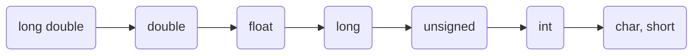

# C Notes 2

### Author's Note: Practices shown in **Precedence - Order of Evaluation** are extremely important, it's best to revise them through to understand how operator priority is evaluated in C.

## Operators

### Logical Operators

| Operator | Meaning | Examples |
| - | - | - |
| `&&` | and | `('A' == 'a') && (3 == 3);` evaluates to 0
| \|\| | or | 2 == 3 \|\| 'A' == 'a'; evaluates to 1
| `!` | not | `!(3 == 3);` evaluates to 0

Example:

```C
#include <stdio.h>

int main(){
    int a = 2, b = 3, c = 10;

    printf("a=%d, b=%d, c=%d\n\n", a, b, c); 

    printf("(a==b)&&(b<c) evaluates to %d\n", (a==b)&&(b<c)); /* evaluates to 1 */
    printf("(a==b)&&(b>c) evaluates to %d\n\n", (a==b)&&(b>c)); /*evaluates to 0 */

    printf("(a==b)||(b>c) evaluates to %d\n", (a==b)||(b>c)); /* evaluates to 1 */
    printf("(a==c)||(b>c) evaluates to %d\n\n", (a==c)||(b>c)); /* evaluates to 0 */

    printf("!(a==c) evaluates to %d\n", !(a==c)); /* evaluates to 1*/
    printf("!(a==b) evaluates to %d\n", !(a==b)); /* evaluates to 0 */

    return 0;
}
```

### Increment and Decrement Operators

| Normal Arithmetic Expressions | Shortcut |
| - | - |
| `x += 1` | `x++` 
| `x -= 1` | `x--` 
| `y = x; x += 1` | `y = x++`
| `y = x; x -= 1` | `y = x--`

**Note for 3rd and 4th expressions, `x` is evaluated before it is decremented. Switching the positions will also switch their order of evaluation.**

### Preincrement and Predecrement vs Postincrement and Postdecrement

Prefix operators increases or decreases before execution, postfix does it the other way round:

```C
int a = 2, b = 3;
printf("%d", a); /* prints 2 */
printf("%d", a++); /* prints 2 then adds 1 so a = 3 */
printf("%d", a); /* prints 3 */

printf("%d", b); /* prints 3 */
printf("%d", ++b); /* adds 1 to b first then prints 4 */
printf("%d", b); /* prints 4 */
```

### Assignment Operators 

Common expressions that can be found while programming is of the type:

```
variable = variable (operator) expression
```

C provides compact assignment operators that can be used instead, this is also known as **syntatic sugar**:

```C
x += 1 --> x = x + 1
x -= 1 --> x = x - 1
x *= 5 --> x = x * 5
x %= 10 --> x = x % 10
x /= 2 --> x = x / 2
```

## Type Casting

Converting data types can be expressed as:

```
(data_type) expresssion
```

Example:

```C
#include <stdio.h>

int main(void){
    int a = 11, b = 5;
    float result;

    result = (float) a/b;
    printf("\n");
    printf("\n");
    printf("%f\n", result);
    return 0;
}
```

## Bitwise Operators

**Bitwise operators manipulate bits of the integral operands** (unsigned and signed `char`, `short`, `int`, `long` ):

| Operator | Expression | Explanation |
| - | - | - |
| `&` | bitwise AND | bits in the result are set to 1 if **both operands are 1**
| `|` | bitwise inclusive OR | bits in the result are set to 1 if **at least one operand is 1**
| `^` | bitwise exclusive OR | bits in the result are set to 1 if **only one operand is 1**
| `<<` | left shift | **shift the bits of the first operand to the left by a value set by the second operand**
| `>>` | right shift | **shift the bits of the first operand to the right by a value set by the second operand**
| `~` | one's complement | **all 0 bits are set to 1 and vice-versa**

### Bitwise AND

Bitwise AND `&` sets each bit to 1 **if the corresponding bit in both operands is 1:**

| Bit 1 | Bit 2 | Bit 1 & Bit 2 |
| - | - | - |
| 0 | 0 | 0
| 1 | 0 | 0
| 0 | 1 | 0
| 1 | 1 | 1

### Bitwise OR and XOR

**Inclusive vs Exclusive:**

- Inclusive OR `|`: each bit to 1 if either (or both bits) is 1
- Exclusive OR `^`: each bit to 1 **if and only if either bits is 1**

| Bit 1 | Bit 2 | Bit 1 `\|` Bit 2 | Bit 1 `^` Bit 2 |
| - | - | - | - |
| 0 | 0 | 0 | 0
| 1 | 0 | 1 | 1
| 0 | 1 | 1 | 1
| 1 | 1 | 1 | 0

### Bitwise Complement (One's Complement)

- turn all 0 bits to 1 and vice-versa:

```C
#include <stdio.h>
int main(void){
    unsigned short int a = 65535, b = 13, complement_a, complement_b;
    complement_a = ~a;
    complement_b = ~b;
    printf("Bitwise Complement: %d\n", complement_a);
    printf("Bitwise Complement: %d\n", complement_b);
    return 0;
}
```

Largest `unsigned int` for a 16bit CPU is `65535`, this means that the complement of 0 is `65535` since $65535-0=65535$

Complement of 13 will be $65535-13=65522$

### Left And Right Shift

`<<` and `>>` shifts the bits by a value to the left or right:

```C
#include <stdio.h>
int main(void){
    unsigned short int a = 13, b = 6;
    printf("Shift Left: %d\n", a<<1);
    printf("Shift Left: %d\n", b<<2);
    printf("Shift Right: %d\n", a>>1);
    printf("Shift Right: %d\n", b>>2);
    return 0;
}
```

We shift the variables' binary values with this example:

**Left Shift:**

```
decimal a = 13
binary a = 1101
shifting a to the left by 1: (a<<1): 1101 --> 11010
decimal a = 13*2 = 26

decimal b = 6
binary b = 0110
shifting b to the left by 2: (b<<2): 0110 --> 011000
decimal b = 6*4 = 24
```

**Right Shift:**

```
decimal a = 13
binary a = 11010
shifting a to the right by 1: (a>>1): 1101 --> 0110
decimal a = 13//2 = 6

decimal b = 6
binary b = 0110
shifting b to the left by 2: (b<<2): 0110 --> 0001
decimal b = 6/4 = 1
```

## Associativity - Priority of Operators - Order of Evaluation

| Operators | Operator Type |
| - | - |
| `*` `/` `%` | multiplicative
| `+` `-` | additive and subtractive
| `<<` `>>` | shifting
| `<` `<=` `>` `>=` | relational
| `==` `!=` | equality
| `&` | bitwise AND
| `^` | bitwise XOR
| `\|` | bitwise OR
| `&&` | AND
| \|\| | OR
| `?:` | conditional
| `==` `+=` `-=` `*=` `/=` `%=` `<<=` `>>=` `^=` `\|=` `&=` | assignment
| `,` | comma

## Precedence and Order of Evaluation (Practices)

**Order of Assignments**
```C
int a = 2;
a=a+(a=a-(a*a));
printf("%d", a);
```

- `a*a`: 4
- assignment of `a`: `(a=a-(a*a))`
    - `(a=2-4)`: `a = -2`
- since `a` is now `-2`, another assignment of `a`: `a=-2+(-2)`
    - `a = -4`

**Relational Operators**

```C
int a = 0;
int b;
a = (a == (a == 1));
printf("%d", a); //prints 1
```

- inner parentheses: `(a == 1)` evaluated to `0`
- outer paratheses: `(a == 0)` evaluated to `1`
- assignment of `a`: `a = 1`

```C
int x, y = 5, z = 5;
x = y == z;
printf("%d", x);
```

- `(y == z)` evaluated to `1`
- assignment of `x`: `x = 1`

### Increment and Decrement Operators (Prefix vs Postfix)

```C
int p, i = 2, j = 3;
p = -i++; 
p = i+++j;
p = i+--j;
p = i+++--j;
p = i+++i++;
p = ++i+(++i);
```

- `p = -i++`
    - `-i++` evaluated to `3` but not assigned to `p` yet
    - `p = -2`
- `p = i+++j`
    - `i++` is considered first because it carries a higher precedence, therefore it evaluates to `3` but not assigned to `p` yet
    - `2+j` where `j = 3`
    - `p = 5`
- `p = i+--j`
    - `--j` **instantly** evaluates to `2`
    - `i+2` where `i = 2`
    - `p = 4`
- `p = i+++--j`
    - `--j` **instantly** evaluates to `2`
    - `i++` evaluated to `3` but not assigned to `p` yet
    - `p = 2+2`: `p = 4`
- `p = i+++i++`
    - 1st occurence of `i++` is evaluated to `3` but not assigned yet
    - consider 2nd occurence of `i++` is already `3++` since the 1st occurence of `i++` **is called to execute**
    - `p = 2+3`: `p = 5`
- `p = ++i+(++i)`
    - **parentheses has the highest precedence:** `(++i)` **instantly** evaluates to `3`, note that **all** `i` **are also instantly evaluated to** `3`**, postfix operators call and update values to every occurence of the desired variable that has not yet been executed**
    - since `i` is now `3`, the other `++i` is now `++3`:
        - `++i` gets evaluated to `4`: `++4`
        - `(++i)`, was previously `(++3)`, **is now** `(++4)` due to another call by postfix `++i`
    - `p = 4+4`: `p = 8`

### Arithmetic Vs Assignment Operators

```C
int a=12;
a+=a-=a*a;
```

- `a*a` evaluated to `12*12 = 144`
- `a-=144` where `a` is still `12`:
    - `a = 12 - 144`: `a = -132`
- `a+= -132` where a is `-132`:
    - `a = -132 + (-132)`
- `a = -264`

```C
int a=2;
a%=4-1;
a+=a*=a-=a*=3;
```

- `a*=3` evaluated to `2*6 = 12`
- `a-=12` where `a` is `12:
    - `a = 12 - 12`: `a = 0`
- `a*=0` evaluated `0`
- `a+=0` evaluated to `0`
- `a = 0`

```C
#include <stdio.h>
void main ( ){
    int x, y = 7;
    float z = 4;
    x = (y = y + 6, y / z);
    printf ("x = %d\n", x);
}
```

- parentheses evaluated from left to right separated by comma: `y += 6`
    - `y = 13`
- `y/z` is evaluated as `y//z`: `13//4 = 3` 
- `x = 3`

### Order of Evaluation on `int` and `float` Types

Precedences are prioritized from highest precision point to lowest:

**Left (Highest) to Right (Lowest)**



```C
#include <stdio.h>
void main ( ){
    float a, b, c;
    a = 7 / 2;
    b = 7 / 2 * 1.0;
    c = 1.0 * 7 / 2;
    printf ("a = %f, b = %f, c = %f", a, b, c);
}
```

- `a`: division of int between int then change to float `3.000000`
- `b`: division of int between int then a multiplication of int and float: `3.000000`
- `c`: multiplication of float and int, **int is converted to float first then multiply:** `1.0*7.0 = 7.000000`
    - division of float between int, int is also converted to float first before being divided: `7.000000/2.000000 = 3.500000`

### **Note that** `float` **always outputs 6-7 precision digits, in this context it's 6.**

## Enumeration Constants

- `enum`
- set of integer enumeration constants represented by identifiers:

```C
enum months {
    JAN, FEB, MAR, APR, MAY, JUN, JUL, AUG, SEP, OCT, NOV, DEC
};
```

This creates a new type `months` in which the index in the enumeration array are set to integers 0-11, respectively.

Enumeration ranges can be manipulated by placing an integer as the starting point of the enumeration:

```C
enum months{
    1, JAN, FEB, MAR, APR, MAY, JUN, JUL, AUG, SEP, OCT, NOV, DEC
};
```

The range of `months` is now **1-12.**

## Conditional Expressions

If else blocks can be declared similarly to python:

```C
if (condition){
    expression;
}
else{
    expressions;
}
```

**Using tenary operators to provide syntatic sugar for this particular statement:**

```
variable=(condition)?(expressions if true):(expressions if false)
```

```C
if (x>=0){
    s = 1
}
else{
    x = -1
}

//simplified:

s=x>=0?1:-1
```

## Blocks and Compound Statements

### Simple Blocks

- simple statement ends with semicolon `;`:
    - `z = foo(x+y);`
- multiple statements using `foo`:

```C
temp = x+y;
z = foo(temp);
```

`foo()` provides ease of use to replace expressions with variables without reassigning.

- block can substitute for simple statement
    - compiled as a single unit
    - variables can be declared inside
    - semicolons not needed

```C
{
    int temp = x+y;
    z = foo(temp);
}
```

Block can be empty too: `{}`

### Nested Blocks 

```C
{
    int temp1 = x-y;
    z = foo(temp);
    {
        float temp2 = x*y;
        z += bar(temp2);
    }
}
```

`bar()` is used to create bar tables.

## Control Flow

Unlike C++, Java, Python etc that has `boolean` values (can include `<stdbool.h>`). **In C, condition is an expression or a series of expressions.**

- if expression is non-zero - **Condition is true**x
- expression must be numeric (or a pointer)

```C
const char str[] = "this is a series of characters";
if (str) /* string is not null */
    return 0;
```

## Conditional Statements

### C's Equivalent of `elif` 

`Else if` is C's equivalent to python's `elif` function, it adds alternative control paths so in order, the program will look into else if blocks before going to the else statement when the previous if condition is not met.

```C
if (a>0)
    x++;
else if (a==0)
    x--;
else
    x = 1
```

This can be written with nested if blocks too:

```C
if (a>0)
    x++;
    if (a==0)
        x--;
else
    x = 1;
```

### `switch` Statement

`switch` is used to iterate an alternative conditional statements. It can be used for `int` and `char` input. 

- consider cases for value of variable:

```C
char s;

printf("Type a character from a-d:\n")
scanf("%c", &s);

switch (s){
    case 'a':
        printf("U typed a");
        break;
    case 'b':
        printf("U typed b");
        break;
    case 'c':
        printf("U typed c");
        break;
    case 'd':
        printf("U typed d");
        break;
    default: /*otherwise or else*/
        printf("error");
        break
}
```

`switch` is a more tidy approach to store multiple test cases in a block. **It is a must to include** `break` **statement to conclude a case.**

### Multiply Case

- compare variable to each case in order
- inner code starts to execute when match found until `break;`
- execution "falls through" if `break;` not included (not recommended)

```C
switch (s){
    case 'a':
    case 'b':
    /* expression starts when either case 'a' or case 'b' is met */
        break;
}
```

`break` vs no `break`:

With `break` every case can be treated individually:

```C
switch (s){
    case 'a':
        printf("U typed a"); /* do print method when case 'a' is reached until break; */
        break;
    case 'b':
        printf("U typed b"); /* do print method when case 'b' is reached and case 'a' is not met, until break */
        break;
```

Without `break`, cases are joined similarly to `or` statements:

```C
switch (s){
    case 'a':
        printf("U typed a"); /* do print method when case 'a' is reached */
    case 'b':
        printf("U typed b"); /* do print method when either case 'a' or case 'b' is met */
        break;
}
```

## Loop Statements

### `while` Loops

Similar to python, `while` loop in C is written with almost the same syntax:

```C
while (/* condition */)
    /* expressions */
```

### `for` Loops

The loop with a counter, or called *counting* loops, can be written in this syntax:

- Python

```python
for i in range(5):
    print("hi!\n")
```

- C

```C
n = 5;
for (i = 0, i <= n, i++){
    printf("hi!\n");
}
```

### Factorial Example

```C
int factorial (int n){
    n = 5;
    int i, j;
    for (i = 1, j = 1; i <= n; i++){
        j *= i;
    }
    return j;
}
```

- simplified version

```C
int factorial (int n){
    int i, j;
    for (i = 1, j = 1; i <= n; j *= i, i++)
    ;
    return j;
}
```

### `do-while` Loop

`do-while` differs from the conventional `while` loop statement:

```C
char c;
do {
    puts("Hi!\nY/N\n");
    c = getchar();
} while (c == 'Y');
```

Notice how the expressions are executed before the loop condition is met. This is to say each loop is iterated first before evaluating the condition so that the iterations are prioritized.

**Note that for this statement,** `while` **needs a semicolon to end.**

### `break` Keyword

`break` is used to exit an iteration or terminate a loop early, it's usage is also similar to python.

### `continue` Keyword

`continue` is used to skip an iteration, or skips the rest of the innermost loop body and jumps to the next loop condition. This could be understood by calling it an *ignore* expression.

## Functions

C programs are built on functions like `main()`, functions like this are pre-built on the ide unlike python where u have to define it using `def`.

However, in C u can also create new functions and use them in programs.

### Euclidean Algorithm Example

Find integers using [Euclidean Algorithm](https://www.khanacademy.org/computing/computer-science/cryptography/modarithmetic/a/the-euclidean-algorithm#:~:text=The%20Algorithm,%3D%20B%E2%8B%85Q%20%2B%20R) in
$$ax+by = gcd(a,b)$$

```C
int gcd(int a, int b){
    while (b){
        int temp = b;
        b = a % b;
        a = temp;
    }
    return a;
}
```

### Pseudocode Explanation

```
Initialize state variables (x,y)
if (a < b)
swap(a,b)
while (b > 0) {
compute quotient, remainder
update state variables (x,y)
}
return gcd and state variables (x,y)
```

**Unlike python, it is important to know that functions in C only return up to one value! U can do a workaround by implementing global variables.**

## Modular Programming

- C programs don't need to be monolithic
- **Module: interface and implementation**
    - **interface: header files**
    - **implementation: auxiliary source/object files**
- Same concept carries over to external libraries

## The Euclid Module

Euclid algorithms are useful in many implementations and can be included in many programs. Euclid modules contain header (`.h`) and source files (`.c`):

```C
int gcd(int a, int b){
    while (b){
        int temp = b;
        b = a % b;
        a = temp;
    }
    return a;
}
```

Extended Euclidean algorithm can be implemented as `ext_euclid()`, also in `euclid.c`.

### `extern` Keyword

`extern` is used to inform other source files about functions/global variables in `euclid.c`.

- for functions: put function prototypes in header file
- for variables: redeclare global variables `extern` in header file

`extern` also informs compiler that variable defined somewhere else and enables access to modify a global variable from other source files.

### `euclid.h` Header 

Header contains prototypes for `gcd()` and `ext_euclid()`:

```C
#ifndef __EUCLID_H__
#define __EUCLID_H__

extern int x, y;

int gcd(int a, int b);

int ext_euclid(int a, int b);

#endif
```

### Using the `euclid.h` Module

- calling `gcd()` or `ext.euclid()` from the main file `diophant.c`
- include header file `euclid.h`
- can call as any other function:

```C
g = gcd(a, b); /* compute g = gcd(a, b); */

g = ext_euclid(a, b); /* compute a and b using pre-defined Extended Euclidean Algorithm ext_euclid(a, b); */
```

- results in global variables `x` and `y`:

```C
grow = c/g
x *= grow;
y *= grow;
```

### Compiling With The Euclid Module

- just compiling `diophant.c` is insufficient
- `gcd()` and `ext_euclid()` are defined in `euclid.c`; this source file needs to be compiled too
- when compiling in source files, the outputs need to be linked together into a single output

## Variable Scope 

Declaring and calling functions are similar to python, a function contains:

- **Return Type: data type of the value returned**
    - `void` is similar to `None`, it's returned when nothing returns from the function when called
- **Function Name: name of the function**
- **Parameters: placeholder, value passed from the caller to function**
- **Function Body: expressions in the function block**

### Example of Different Scopes in C

**Local vs Global:**

```C
int nmax = 20;

int main ( int argc , char ∗∗ argv )
{
    int a = 0 , b = 1 , c , n ;
    printf( "%3d: %d\n" ,1 ,a );
    printf( "%3d: %d\n" ,2 ,b );
    for ( n = 3; n <= nmax ; n++) {
        c = a + b ; a = b ; b = c ;
        printf( "%3d: %d\n" ,n , c ) ;
    }
    return 0;
}
```

`nmax` here is a **global variable** that can be used in all functions that are declared, in this case it's `main()`. Inside main we have `a`, `b`, `c` and `n`, these are **local variables** declared and used **only** in `main()` function, or so called *local to* `main()`.

Output:

```
  1: 0
  2: 1
  3: 1
  4: 2
  5: 3
  6: 5
  7: 8
  8: 13
  9: 21
 10: 34
 11: 55
 12: 89
 13: 144
 14: 233
 15: 377
 16: 610
 17: 987
 18: 1597
 19: 2584
 20: 4181
```

### Scope and Nested Declarations

Global variables can be reassigned to a different value in a function:

```C
int nmax = 20;

int main ( int argc , char ∗∗ argv )
{
    int a = 0 , b = 1 , c , n, nmax = 15;
    printf( "%3d: %d\n" ,1 ,a );
    printf( "%3d: %d\n" ,2 ,b );
    for ( n = 3; n <= nmax ; n++) {
        c = a + b ; a = b ; b = c ;
        printf( "%3d: %d\n" ,n , c ) ;
    }
    return 0;
}
```

Output:
```
  1: 0
  2: 1
  3: 1
  4: 2
  5: 3
  6: 5
  7: 8
  8: 13
  9: 21
 10: 34
 11: 55
 12: 89
 13: 144
 14: 233
 15: 377
```

## `static` and `register`

### Static Variables

Static variables have a special property of preserving their value even after they are out of scope. They preserve their previous values and are not initialized again in the new scope.

Static variables have two meanings depending on the location they're declared:

### Outside Function

Static variables/functions are only visible within that file, not globally (cannot be `extern`-ed)

### Inside Function

Static variables:
- still local to that function
- are initialized only during program initialization
- do not get reinitialized with each function call

```C
static int random_static_var = 0;
```

### Register Variables

`register` **provides a more useful and faster approach to access commonly used data and minimize load/store overhead.** Registers are faster than memory to access, it hints to compiler that a given variable can be put in a register. It's the compiler choice to put it in or not but generally they do optimizations themselves and put variables in registers.

- during execution, data processed in registers
- can explicitly declare certain variables as registers using `register`

### What Can Be Registered?

- simple types (implementation-dependant)
- **only local variables and function arguments**
- excess/unallowed register declarations ignored, compiled as regular variables
- **Registers do not reside in addressed memory; pointer of a
register variable is illegal**

Variable scope examples with `register` implementation:

```C
#include <stdio.h>

int nmax = 20;

int main ( register int argc , register char ** argv )
{
    register int a = 0 , b = 1 , c , n, nmax = 15;
    printf( "%3d: %d\n" ,1 ,a );
    printf( "%3d: %d\n" ,2 ,b );
    for ( n = 3; n <= nmax ; n++) {
        c = a + b ; a = b ; b = c ;
        printf( "%3d: %d\n" ,n , c ) ;
    }
    return 0;
}
```

