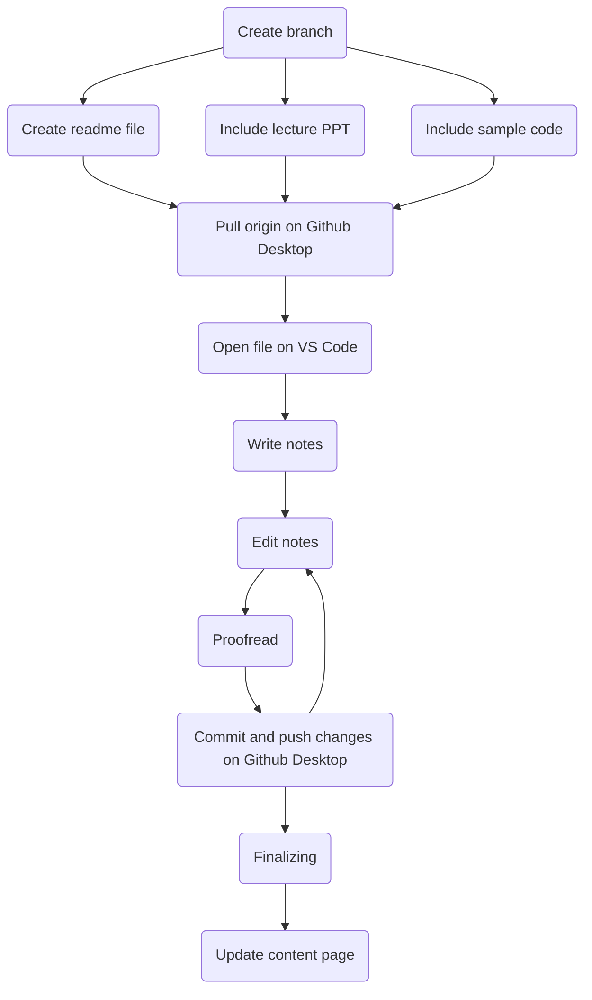

# For Writers

## Welcome to MATB Private Library Writer's Hub 

-----

## Preface

> For students, by students.

**MATB's Private Library is an initiative to provide students a thorough study hub for their courses, giving proper self-study and quick reference resources.**

### Why Github?

Github is an extraodinary platform to facilitate project flow and code editing. For example, [MIT6](https://github.com/MATBckh22/MATB-STUDIOS/blob/d868c24226ffea27bbe3cc0f7250d70be3d729a5/README.md) lecture notes are written entirely through Github using their custom markdowns and third-party libraries. It's a powerful tool that connects the line from a student passively choking on knowledge spoonfed by lecturers to writing a full-fledged tutorial on what the student had learnt.

The library is built essentially to replace your ordinary paper and pen notes, saving time and effort while using more appealing visual aids.

## Rules and Ethics

**MATB strictly follows Github's [Terms of Service](https://docs.github.com/en/site-policy/github-terms/github-terms-of-service) to provide a friendly user experience while respecting the original author's work.** Building on these foundations, every author and developer in MATB has a few guidelines to adhere:

### When broken, you're banned

- Resources in the library are **completely free**, do not charge fees for any content in the hub. 
    - However, MATB doesn't limit members outside the hub, MATB doesn't account for any liabilities for any transcations made personally.
- **Plagarism is banned here**, *minimal paraphrasing is allowed.* 
    - If the author thinks that the text cannot be explained better, quote using `>` and give the proper reference. (academic referencing of any kind is recommended, otherwise clearly state your reference in your own words)
    - **Do not include problems in academic exams, quizzes, finals that are from your local institute in your notes. Tutorials, exercises and projects that your instrutor, lecturer or professor didn't assert it's confidentiality are allowed.**
    - MATB cannot allow posting links or files with pirated content.
- **Do not post NSFW, gore, violence, provocative, sexual-hints, insulting or inappropriate content.**
    - This also includes, but not limited to showing discrimination, harrassment and gaslighting political views and prejudices. **Keep your dank political humor to yourself.**
- Unsolicited advertising, spamming, trolling, writing nonsensical statements and text flooding are red flags here.
    - nonsensical statements here are defined as statements that bear not even the slightest sense of grammar, statements that cannot be deciphered by a human.
- **Do not cheat on tests and exams.** Do not be academically dishonest. Do not offer money for doing homework assignments, and vice-versa.
- Do not publish or include people's private information without their consent. 

### Follow this and you're cool

- **Respect topics in the same section, double check that you're writing in the right place.**
- **Write from the perspective of a learner, avoid shortforms, slangs.** You're writing open-source notes that are being shown in public, write and format in your own style but consider that it's human-readable.
- Feel free to include your social media, but avoid giving out your personal details in the hub. 
- Avoid including your personal feelings and emotional baggage when writing, you don't want your readers to feel that you're passive-aggressively venting.
    - This includes metaphoring or hinting any kind of conflict, drama, etc. 
- Be as fluent in your writing as possible. Writing is a showcase of language. Revise and check for any grammatical errors, topics that are incomplete or not explained clearly and more. **If you're planning to edit these sections later, include it in a section from your content page.**

**In general, apply common sense and be respectful, your main audience is people who are interested but don't have a direction to start. You're a guide, not an egotistic show-off.**

## Get Started

Starting fresh with [Github](https://github.com/) often times can be scary. It does not have an aesthetic user interface, it's built to be efficient on project flow for programmers. 

After signing up, head to [Github's detailed description on how to get familiar with it's platform](https://docs.github.com/en/get-started/quickstart/github-flow) and quickly review the instructions given. You want to briefly familiarize yourself with it's features, which includes:

- forking repositories
- push and pull origins
- branching
- creating, editing, renaming, deleting and relocating files
- markdowns/formatting on readme files
- pull requests

When you personally think that you're fluent with managing these features, you can increase your productivity by using [Github Desktop](https://desktop.github.com/) and [Visual Studio Code](https://code.visualstudio.com/) together to make your work more efficient. These two tools are the bread and butter to getting your work done faster.

### Github Desktop

[Github Desktop](https://desktop.github.com/) is a more refined and convenient tool to make changes on your branches and notes. Read [this simple startup guide](https://docs.github.com/en/desktop/installing-and-configuring-github-desktop/overview/getting-started-with-github-desktop) on how to install, run and use Github Desktop to replace Github's web browser edition.

### Visual Studio Code With Github

[Visual Studio Code](https://code.visualstudio.com/) is a text editor to edit your code and projects in a way that your eyes don't hurt as much. [This guide](https://code.visualstudio.com/docs/editor/github) will help you to manage your repositories. You don't have to read it until the end if you're using it with Github Desktop.

### Control Flow

Proper control flow is essential to organize your workspace and not have messy branches and changes that you struggle to track. In this section I would provide an example of how I create and edit notes for MIT6's Computer Science Course:



Of course, you will get the hang of the writing and publishing process when you're more and more experienced with it.

## Formatting - Basic Github Markdowns

Everything you see here is formatted through Github's custom markdowns. This is how I would format content in my notes:

### Headings

```markdown
# Largest Heading

This is used for the name of the chapter.

## Second Largest Heading

This is used for the name of the topic.

### Third Largest

This is used for the name of the subtopic.
Headings could go up to 5 #, but it is advised to just use the three largest ones.
```

### Styling Text

Here are text styles that Github supports:

| Style | Syntax | Example | Output | Keyboard Shortcut |
| - | - | - | - | - |
| Bold | `**` `**` or `__ __` | `**Bold text**` | **Bold text** | Highlight and `Ctrl+B`
| Italic | `*` `*` or `_` `_` | `*Italicized test*` | *Italicized test* | Highlight and `Ctrl+I`
| Strikethroughs | `~~` `~~` | `~~Strikethrough/Mistaken text~~` | Strikethrough/Mistaken text~~
| Bold and nested italic | `**` `**` and `_` `_` | `**This text is _extremely_ important**`| *This text is _extremely_ important**
| Subscript | `<sub>` `</sub>` | `<sub>Subscript text</sub>` | <sub>Subscript text</sub>
| Superscript | `<sup>` `</sup>` | `<sup>Superscript text</sup>` | <sup>Superscript text</sup>

### Supported Color Models

`#0969DA`

### Lists

Hyphens `-` are used to creating **pointed** lists, just like this:

```markdown
- markdowns are cool
- markdowns make my life easier
- i love markdowns

- markdowns allow nested lists too
    - like this
        - and this, it goes on and on
```

- markdowns are cool
- markdowns make my life easier
- i love markdowns
    - markdowns allow nested lists too
        - like this
            - and this, it goes on and on

If you instead, prefer a numerical approach, you can replace `-` with numbers:

```markdown
1. markdowns are cool
2. markdowns make my life easier
3. i love markdowns
```

1. markdowns are cool
2. markdowns make my life easier
3. i love markdowns

### Quoting text

Quoting text looks like this:

```
Normal text

> quoted text
```
Normal text

> quoted text

You can have multiple `>` to quote your text but it's not recommended, they look rather weird:

>>>>>>>> multiple quotes

### Code Blocks

Code blocks are spaces that ignore Github markdowns, it is used to type your code in, create a code block by typing triple backticks ` ``` ` at the start and bottom of your code:

````
```
Your code
```
````

*Note that if you want to include triple backticks in a code block you have to wrap it with quadruple backticks.*

```
#include <stdio.h>

int main() {
   /* my first program in C */
   printf("Hello, World! \n");
   
   return 0;
}
```

Of course, syntax highlighting is supported in Github using [Linguist](https://github.com/github/linguist) and [third-party grammars](https://github.com/github/linguist/blob/master/vendor/README.md)

Add the name of the language right after you typed ` ``` `:

C's example:

```C
#include <stdio.h>

int main() {
   /* my first program in C */
   printf("Hello, World! \n");
   
   return 0;
}
```

Python's example:

```python
#simple method to print Hello World!
print("Hello World!")
```

If you only want to call out a one simple line of a sentence or code, something like `print("Hello World!")`, use **only single backticks.**
### Links and Images

Include a link using this syntax:

```
[Your text](URL)
```

Example:

```
[Download Visual Studio Code here!](https://code.visualstudio.com/)
```

[Download Visual Studio Code here!](https://code.visualstudio.com/)

Similar to links, include an image using this syntax:

```

```

Example:

```

```


### Tables

You can create organized tables using pipes `|` and hyphens `-`. Hyphens are used to create each column's header, where pipes separate each column:

```
| First Title | Second Title |
| - | - |
| Cell L1 | Cell R1 |
| Cell L2 | Cell R2 |
```

| First Title | Second Title |
| - | - |
| Cell L1 | Cell R1 |
| Cell L2 | Cell R2 |

###

## What To Include In Your Notes

### Basic Content Page

Feel free to change the names of these sections in your own content page as long as they exists:

- Author's Note (optional)
- **Updates**
    - **incomplete chapters**
    - declaration on notes that are complete
- Summary (optional)
    - course difficulty
    - topics covered
    - chapters that needs to be primarily focused
    - general flow of course
    - approximate duration to finish course
- Preparation Measures
    - **software/tools needed to download, resources, etc. Brief them in general and include download links and tutorials**
- **Course Must-Reads**
    - what to expect in your notes
    - learning tools
        - exp: example code for course, lecture ppt, etc
- Other Materials (optional)
    - other resources that are not included in your course
    - useful tools/libraries/topics

Get a general idea of the framework for your content page by looking at [this example](https://github.com/MATBckh22/MATB-STUDIOS/blob/d868c24226ffea27bbe3cc0f7250d70be3d729a5/README.md)

## Main Content